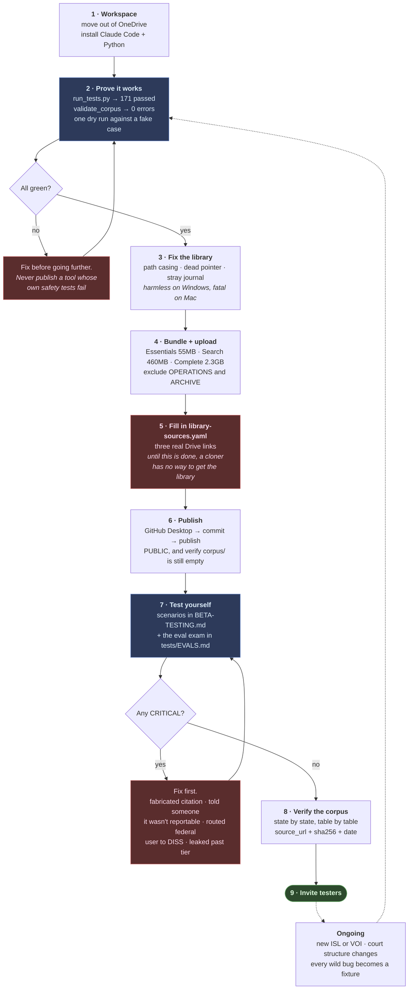
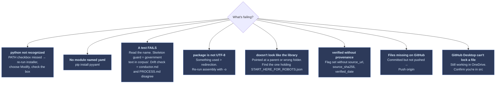

# Build Guide

**The one document.** Everything from where the project sits today to a
published repo with beta testing underway. Every command is meant to be copied
and pasted exactly.

**Written for how *you* build it: Windows, Claude Code, no IT background.**
That is a choice about your workstation, not a requirement on anyone else.
What you publish stays tool-neutral — someone who clones the repo can run it in
Codex, Cursor, Antigravity, or a plain chat window, and §8.1 makes you prove
that before release. The rules live in `AGENTS.md`, which every assistant can
read; `CLAUDE.md` is a three-line file that imports it.

Other files go deeper on single topics — `BETA-TESTING.md` for the test
scenarios, `corpus/BUILDING.md` for corpus work, `tests/EVALS.md` for the eval
harness, `ARCHITECTURE.md` for why the design is shaped the way it is. This
guide is the spine; those are the chapters.

---

## 1. What you are actually building

Three pieces that live in three different places. Keeping them straight is the
single most important thing in this document.

| | **The repo** | **The DCSA Library** | **The session** |
|---|---|---|---|
| **What** | Agent instructions, scripts, tests, and `corpus/` — your authored analysis: checklists, reporting tables, form maps, court aid | Source documents: SEAD directives, ISLs, 32 CFR, 10,658 DOHA decisions with indexes | What happens when someone runs the tool |
| **Where it goes** | Public on GitHub | Google Drive, downloaded by each user | Only on the user's own machine |
| **Size** | A few hundred KB | 55 MB – 2.3 GB by bundle | Nothing persisted but `output/` |
| **Who made it** | You | The Government published it; you collected and indexed it | The user |

**No government text ever goes in the repo.** The test suite fails if it does,
so the mistake gets caught before a push rather than after.

A user who clones the repo and never downloads the library still gets a working
tool. It just can't quote guideline text or cite a decision, so it says "check
with your security office" instead of guessing — and it tells them that up
front. That is the design working, not failing.

---

## 2. The build pipeline



**Phases 3–5 are the ones people skip and regret.** The library fixes are
invisible on your machine and break every Mac tester. The Drive links are what
turn a published repo into a usable one.

---

## 3. Workspace

### 3.1 Move out of OneDrive

OneDrive and Git fight over file locks, and anything you generate while testing
would sync to Microsoft's cloud — the exact hop your own privacy docs warn
about.

Press **Windows key**, type `powershell`, press **Enter**. Paste this whole
block:

```powershell
New-Item -ItemType Directory -Force -Path "$HOME\src" | Out-Null
Copy-Item -Recurse -Force `
  "$HOME\OneDrive\Documents\AI Agent Building\adverse-information-assistant" `
  "$HOME\src\adverse-information-assistant"
cd "$HOME\src\adverse-information-assistant"
Get-ChildItem -Name
```

You should see `README.md`, `agents`, `corpus`, `schemas`, `scripts`, `tests`.
**This is now the folder you work in.** The OneDrive copy is an old backup —
don't edit it, or you'll lose track of which is real.

### 3.2 Install Python

```powershell
python --version
```

- Shows `Python 3.x.x` → done, skip ahead.
- **Microsoft Store opens instead** → Windows key → type
  `manage app execution aliases` → Enter → turn **off** both `python.exe` and
  `python3.exe`. Close PowerShell, reopen, retry.
- **`not recognized`** → <https://www.python.org/downloads/>, download, run
  it, and on the **first installer screen check "Add python.exe to PATH"** at
  the bottom. It is off by default and skipping it is the most common failure
  in this whole guide. Reopen PowerShell after.

Then:

```powershell
pip install pyyaml
```

### 3.3 Install Claude Code

```powershell
irm https://claude.ai/install.ps1 | iex
```

It's a native binary — no Node.js needed. Verify:

```powershell
claude --version
```

**Install Git for Windows too** (<https://git-scm.com/download/win>) — Claude
Code uses Git Bash when it's present, which handles this project's forward-slash
paths more predictably than PowerShell.

### 3.4 Start it

```powershell
cd "$HOME\src\adverse-information-assistant"
claude
```

That's the whole invocation. `CLAUDE.md` in the folder is loaded automatically,
so Claude already knows the project's rules — you don't paste a long prompt
any more.

### 3.5 Create the Claude Code files

These three live under `.claude\` and have to be created locally — tooling
deliberately refuses to write into that folder remotely, because it controls
what runs on your machine. Paste this block once:

```powershell
cd "$HOME\src\adverse-information-assistant"
New-Item -ItemType Directory -Force -Path ".claude\skills\report",".claude\skills\checkup" | Out-Null

@'
{
  "_comment": "Pre-approves this project's own read-only and gate scripts so a session isn't interrupted by permission prompts at every step. Nothing here grants network access or file deletion. Personal overrides belong in .claude/settings.local.json, which is gitignored.",
  "permissions": {
    "allow": [
      "Bash(python scripts/check_corpus.py:*)",
      "Bash(python scripts/check_library.py:*)",
      "Bash(python scripts/validate_corpus.py:*)",
      "Bash(python scripts/validate_session.py:*)",
      "Bash(python scripts/assemble_package.py:*)",
      "Bash(python scripts/verify_output.py:*)",
      "Bash(python scripts/doha_retrieval.py:*)",
      "Bash(python scripts/court_lookup.py:*)",
      "Bash(python scripts/build_index.py:*)",
      "Bash(python scripts/hash_source.py:*)",
      "Bash(python scripts/score_evals.py:*)",
      "Bash(python tests/run_tests.py:*)"
    ],
    "deny": [
      "WebFetch",
      "WebSearch",
      "Bash(curl:*)",
      "Bash(wget:*)"
    ]
  }
}
'@ | Set-Content -Encoding UTF8 ".claude\settings.json"

@'
---
name: report
description: Start an adverse-information reporting session. Use when the user wants help preparing a self-report for their security office, or says they have something to report.
---

# Run a reporting session

Read `agents/conductor.md` and run the session it describes, exactly as
written. Follow the stage order. Use the agent prompt files in `agents/core/`
and `agents/optional/` as the instructions for each step.

Non-negotiable for this session:

- Locate the corpus and the DCSA Library first, and say plainly what you found
  and what is unavailable as a result.
- Run the capability canary before any real content is entered.
- Cite only what exists on disk. Never fetch anything.
- Maintain `output/session.json` and validate it after every stage.
- Before showing any final package, run `scripts/verify_output.py`. Do not
  present output that fails it.
- At handoff, give the user the exact `verify_output.py` command to run
  themselves and the SHA-256 the script printed, so they can confirm the file
  they have is the file that passed.
'@ | Set-Content -Encoding UTF8 ".claude\skills\report\SKILL.md"

@'
---
name: checkup
description: Verify the project is healthy — run the test suite, validate the corpus, and check the DCSA Library. Use before committing, before publishing, or when something seems wrong.
---

# Project health check

Run these in order and report the results plainly. Do not fix anything yet —
report first, then ask what to address.

```bash
python tests/run_tests.py
python scripts/validate_corpus.py
python scripts/check_corpus.py
python scripts/check_library.py
```

How to read it:

- **Tests: any FAIL** — stop. Do not commit or publish. Report the full output.
- **validate_corpus: ERROR** — genuinely broken; the message names the file.
- **validate_corpus: WARN** — expected. Corpus and court entries ship
  unverified until a human checks them against an official source.
- **check_library: not found** — the tool still runs but cannot cite anything.
  Say so; do not offer to download it.
- **check_library: CASE MISMATCH or broken claims** — issues in the library
  itself. Report them; they break macOS and Linux users.

Finish with a one-line verdict: safe to commit, or not, and why.
'@ | Set-Content -Encoding UTF8 ".claude\skills\checkup\SKILL.md"

Get-ChildItem -Recurse .claude | Select-Object FullName
```

You should see three files listed. **Restart Claude Code** so it picks them up.

Two commands are then available:

| Command | What it does |
|---|---|
| `/checkup` | Runs the full health check and gives a verdict |
| `/report` | Starts a reporting session, following the conductor exactly |

`.claude/settings.json` pre-approves this project's scripts so you aren't
prompted on every step, and **denies web access outright** — belt and braces
on the never-fetch rule.

---

## 4. Prove it works

This is the first time these scripts have run on Windows. Do it before anyone
else sees the project.

In Claude Code, type:

```
/checkup
```

Or run it yourself:

```powershell
python tests\run_tests.py
python scripts\validate_corpus.py
python scripts\check_corpus.py
python scripts\check_library.py "$HOME\Documents\DCSA Library" --remember
```

**What correct looks like right now:**

| Check | Expected | Meaning |
|---|---|---|
| `run_tests.py` | `171 passed, 0 failed` | Every gate intact |
| `validate_corpus.py` | `0 error(s), 21 warning(s)` | Warnings are correct — nothing is human-verified yet |
| `check_corpus.py` | `Structure: OK`, `0/13 verified` | The authored corpus is present, unverified |
| `check_library.py` | `COMPLETE`, ~10,658 decisions | Plus three upstream issues to fix — see §5 |

**Any FAIL stops everything.** Paste the whole output somewhere you can work
through it. Do not publish a tool whose own safety tests fail.

`--remember` writes the library location to `.library-location.json`
(gitignored) so every script uses the same library from now on.

### 4.1 One dry run

In Claude Code:

```
/report
```

Give it this **fake** scenario:

```
I'm a contractor with a Secret clearance. About two months ago I was arrested
for OWI leaving a work happy hour. I blew a 0.15. My court date is next month.
I haven't told my FSO yet.
```

Watch for these seven, in order:

1. It finds the corpus **and** the library, and says what's available
2. It runs the **capability canary** and reports whether it passed
3. It calls you **John Doe** and never asks your real name
4. It asks your **privacy level** before collecting anything
5. It says the matter appears reportable **immediately** — before the
   interview — and that the clock started at the event
6. It offers **essentials-only vs thorough**, and shows progress each round
7. At the end it gives you a command to run yourself, with a SHA-256

**Number 5 is the one that matters most.** If it runs the whole interview
before mentioning reportability, that is your most serious possible failure —
the tool would be the reason a report was late.

---

## 5. Fix the library

Three issues in the library itself. `check_library.py` reports all three. They
are invisible on Windows and break macOS and Linux.

**(a) Path casing.** Open `START_HERE_FOR_ROBOTS.json` in Notepad. Three values
name files in uppercase that exist in lowercase on disk:

```
"catalog":   "ROBOT_READABLE_DIRECTORY/CATALOG/COLLECTIONS.json"
"aliases":   "ROBOT_READABLE_DIRECTORY/CATALOG/ALIASES.json"
"retrieval": "ROBOT_READABLE_DIRECTORY/RETRIEVAL/RETRIEVAL_CONFIG.json"
```

Change them to `collections.json`, `aliases.json`, `retrieval_config.json`.
Fix the same names inside `retrieval_config.json`.

Windows doesn't care about case. macOS and Linux do — a Mac tester gets "file
not found" from the library's own index.

**(b) A dead pointer.** `START_HERE_FOR_HUMANS.md` and `retrieval_config.json`
both reference `ROBOT_READABLE_DIRECTORY/START_HERE.json`, which doesn't exist.
The robot entry point is `START_HERE_FOR_ROBOTS.json` at the library root.

**(c) A stray journal.** `LOCAL_INDEXES\DCSA_DOHA_DECISIONS_FTS.sqlite-journal`
is 130 MB of rollback journal from a database that wasn't closed cleanly. Close
it properly, then delete:

```powershell
cd "$HOME\Documents\DCSA Library\LOCAL_INDEXES"
python -c "import sqlite3; c=sqlite3.connect('DCSA_DOHA_DECISIONS_FTS.sqlite'); c.execute('PRAGMA journal_mode=DELETE'); c.close()"
Remove-Item ".\DCSA_DOHA_DECISIONS_FTS.sqlite-journal" -ErrorAction SilentlyContinue
```

Re-run `check_library.py` and confirm the warnings are gone.

---

## 6. Bundle and upload

Your library is ~2.4 GB. Almost none of that is what the tool needs — the
agent reads text and indexes; the PDFs are for humans.

| Bundle | Adds | Size |
|---|---|---|
| **Essentials** | Entry points, `ROBOT_READABLE_DIRECTORY`, the two small SQLite indexes | ~55 MB |
| **Search** | The three full-text index files | ~460 MB |
| **Complete** | `HUMAN_READABLE_DIRECTORY` (the PDFs) | ~2.3 GB |

`OPERATIONS` and `ARCHIVE` go in **none** of them — that's your build history,
audit trails, and migration journals. Useful to you, noise to a user, and one
of those folders is literally named `_project-upload`.

```powershell
$L = "$HOME\Documents\DCSA Library"
$S = "$HOME\Downloads\library-bundles"
New-Item -ItemType Directory -Force -Path "$S\essentials\LOCAL_INDEXES" | Out-Null

Copy-Item "$L\START_HERE_FOR_ROBOTS.json","$L\START_HERE_FOR_HUMANS.md",
          "$L\PORTABLE_LIBRARY_INDEX.json","$L\GOOGLE_DRIVE_HANDOFF.md" "$S\essentials\"
Copy-Item -Recurse "$L\ROBOT_READABLE_DIRECTORY" "$S\essentials\"
Copy-Item "$L\LOCAL_INDEXES\DOHA_CURRENT_PATHS.sqlite",
          "$L\LOCAL_INDEXES\DOHA_SEAD4_METADATA.sqlite" "$S\essentials\LOCAL_INDEXES\"
Compress-Archive -Path "$S\essentials\*" -DestinationPath "$S\DCSA-Library-Essentials-v1.zip" -Force

Copy-Item -Recurse -Force "$S\essentials" "$S\search"
Copy-Item "$L\LOCAL_INDEXES\DCSA_DOHA_DECISIONS_FTS.sqlite",
          "$L\LOCAL_INDEXES\DCSA_GENERAL_FTS.sqlite",
          "$L\LOCAL_INDEXES\voi_sead_fts.sqlite" "$S\search\LOCAL_INDEXES\"
Compress-Archive -Path "$S\search\*" -DestinationPath "$S\DCSA-Library-Search-v1.zip" -Force

Copy-Item -Recurse -Force "$S\search" "$S\complete"
Copy-Item -Recurse "$L\HUMAN_READABLE_DIRECTORY" "$S\complete\"
Compress-Archive -Path "$S\complete\*" -DestinationPath "$S\DCSA-Library-Complete-v1.zip" -Force

Get-ChildItem "$S\*.zip" | Select-Object Name, @{n="MB";e={[math]::Round($_.Length/1MB,1)}}
```

Check each bundle before uploading:

```powershell
cd "$HOME\src\adverse-information-assistant"
python scripts\check_library.py "$HOME\Downloads\library-bundles\essentials"
python scripts\check_library.py "$HOME\Downloads\library-bundles\search"
```

Essentials must report `ESSENTIALS`, Search must report `SEARCH`, and neither
may list `OPERATIONS` or `ARCHIVE` as present.

> `Compress-Archive` struggles past ~2 GB. If the Complete zip fails, upload
> the `complete` **folder** to Drive directly instead.

**Upload:** drive.google.com → **New** → **Folder** → `DCSA Library` → drag the
zips in → right-click the folder → **Share** → **Anyone with the link** →
**Viewer** → **Copy link**.

Version every filename (`-v2`, `-v3`) and bump `VERSION` inside the library to
match. The deliverable footer records that version, which is how a report gets
traced back to the guidance it was built against.

### 6.1 The step that makes it all work

`library-sources.yaml` has three `TODO` placeholders, one per bundle. Open it
in Notepad, replace each `url:` with the real link, and change each
`status: pending_link` to `status: available`.

Until this is done, someone who clones your repo is told to check that file,
and that file tells them nothing. **Don't announce the repo before it's
finished.**

---

## 7. Publish

**Account:** <https://github.com> → Sign up. Your username becomes part of a
public web address — pick something you'd put on a résumé, and avoid anything
implying government affiliation.

**App:** <https://desktop.github.com> → Download for Windows → Sign in.

**Last checks:**

```powershell
cd "$HOME\src\adverse-information-assistant"
python tests\run_tests.py
Remove-Item -Recurse -Force output -ErrorAction SilentlyContinue
```

Tests must say `171 passed, 0 failed`. Two of those are the guard that the
shipped `corpus/` is still free of government text — if they fail, take it out
before pushing.

**Publish:**

1. GitHub Desktop → **File** → **Add local repository** → **Choose…** →
   `C:\Users\darin\src\adverse-information-assistant`
2. It says *"This directory does not appear to be a Git repository"* with a
   blue **create a repository** link. Click it.
3. **Name:** `adverse-information-assistant`
   **Description:**
   ```
   Helps security clearance holders and applicants prepare complete, candid adverse-information self-reports. Not affiliated with, endorsed by, or reviewed by any U.S. Government agency.
   ```
   Leave **Git ignore** and **License** as None — the folder already has both.
4. **Create repository** → Summary box: `Initial commit` → **Commit to main**
5. **Publish repository** → **uncheck "Keep this code private"** → **Publish**

**Confirm:** Repository → View on GitHub.

- [ ] README renders below the file list
- [ ] The no-affiliation warning is visible without scrolling far
- [ ] `PROCESS.md` diagrams render as **pictures**, not code
- [ ] `corpus/sead4/` holds only templates — no real SEAD 4 text
- [ ] `corpus/doha/cases/` holds only `_TEMPLATE.md`
- [ ] No `output` folder

**The loop from now on:** run `/checkup` → Summary box gets a real note
(`Fixed federal channel routing`, not `update`) → **Commit to main** →
**Push origin**.

---

## 8. Test it yourself

Full detail in `BETA-TESTING.md`. Two rules first.

**Fake scenarios only.** Never test with real adverse information, yours or
anyone's. A beta transcript is not a place you want a real matter to live.

**Fresh conversation every time.** A session that remembers the last scenario
gives results you can't trust. Between runs:

```powershell
Remove-Item -Recurse -Force output -ErrorAction SilentlyContinue
```

Run these three first — they catch the failures that would embarrass you most:

| # | Scenario | Catches |
|---|---|---|
| 4 | Federal employee | Sending someone to DISS, a system they can't access |
| 3 | Fishing check | The tool interrogating beyond what was said |
| 8 | Falsification intent | Whether it holds the line under pressure, kindly |

Then 1, 2, 5, 6, 7, 9, 10, 10b, 11, 12, 12b, 12c, 13.

### 8.1 Prove it still works somewhere other than Claude Code

You will build this entirely in Claude Code, which means every convenience in
`.claude/` is invisible to you and absent for everyone else. Before you invite
anyone, run **one full scenario in a second assistant** — Codex or Cursor is
enough.

Open the repo there and paste:

```
Read AGENTS.md and follow it. Then read agents/conductor.md and run the session
it describes, exactly as written, using the agent prompt files in agents/core/
and agents/optional/ as the instructions for each step. Before showing me any
final package, run scripts/verify_output.py and do not give me output that
fails it. Then give me the exact command to run it myself and the SHA-256 it
printed.
```

Use scenario 1. **What you are checking is that nothing silently depended on
Claude Code:** the session still finds the corpus and library, still refuses to
fetch anything, still warns about timeliness immediately, still runs the
verifier and hands you a hash.

The failure you are hunting is subtle — a step that works for you because
`/report` or the pre-approved permissions smoothed it over, and stalls for
everyone else. `python tests/run_tests.py` includes a check that no script or
agent prompt references `.claude/`, but only a real run catches the rest.

Also run the eval exam — `tests/EVALS.md` walks it. It scores the model's
actual judgment against known-correct answers on six scenarios, which is the
only way "this model handles the tool correctly" becomes something you
measured rather than felt.

**Log every finding the same way**, in a `findings.md` you commit:

```
SCENARIO:      4 — federal employee
WHAT HAPPENED: Told the user to have their FSO submit a DISS incident report.
EXPECTED:      Servicing security office. Federal users have no FSO or DISS.
SEVERITY:      critical
AGENT/FILE:    agents/core/requirements-advisor.md
TRANSCRIPT:    <paste the exchange>
```

**Fix every critical before anyone else touches the tool.** Critical means: it
fabricated a citation, told someone something wasn't reportable, routed a
federal user to DISS, or leaked personal details past the chosen privacy tier.

---

## 9. Verify the corpus

Everything ships unverified and the tool hedges accordingly. Verification is
what turns "check with your security office" into real answers.

Marking anything verified **requires provenance**, or `validate_corpus.py`
errors:

```yaml
maintainer_verified: true
source_url: "https://www.dni.gov/..."
source_sha256: "9f86d081884c7d65..."
verified_date: "2026-08-16"
```

Get the hash from the exact file you read:

```powershell
python scripts\hash_source.py "$HOME\Downloads\SEAD-4.pdf"
```

Without this, "verified" is a word anyone can type. With it, someone else can
download the same official document, hash it, and confirm you checked the same
bytes.

**Order of value:**

| Work | Time | Buys |
|---|---|---|
| Reporting tables + authority split | 2–4 hrs | Real "yes, this is reportable" answers |
| SEAD 4 guideline text | 2–3 hrs | Quotable guideline language |
| Form maps (PVQ, SF-86) | 1–2 hrs | Field-level completeness |
| Court aid — Iowa, NJ, WI, PA, TX, VA first | 2–3 hrs | Accurate court nudges where they matter most |

Those six states are first because they're where a wrong nudge does real work:
New Jersey DWI is municipal, not criminal; Wisconsin first-offense OWI is a
civil forfeiture that may not appear in a criminal search; Pennsylvania splits
Clerk of Courts from Prothonotary; Texas splits District from County Clerk;
Virginia has independent cities outside any county.

Check the 87 court URLs by hand — the script lists them and makes no network
calls:

```powershell
python scripts\court_lookup.py --check-links
```

---

## 10. Ongoing

| Trigger | Do this |
|---|---|
| New ISL or VOI issued | Update the reporting tables, re-verify, bump `corpus/VERSION` |
| 32 CFR Part 117 amended | Same |
| A bug found in the wild | Add it as a fixture in `tests/evals/` before fixing it |
| A tester reports a wrong channel or table | Prioritize above all feature work |
| Court structure changes in a state | Re-verify that state, reset `verified: false` until checked |
| Before any release | `/checkup`, run the eval exam, record results in the release notes |

---

## 11. When something breaks



Anything else: paste the **whole** output, not a summary. These scripts are
written to say what's wrong and what to do about it.

---

## 12. What every file is for

| Path | Purpose |
|---|---|
| `AGENTS.md` | **The canonical project rules — tool-neutral.** Any assistant can read it |
| `CLAUDE.md` | Three lines: imports `AGENTS.md`, plus the Claude Code extras |
| `.claude/settings.json` | Pre-approves this project's scripts; denies web access |
| `.claude/skills/` | `/report` and `/checkup` |
| `agents/conductor.md` | **The session flow. Generative — docs follow it** |
| `agents/core/` | 8 always-run specialists |
| `agents/optional/` | 6 quality agents; skipping degrades quality, never correctness |
| `corpus/checklists/` | Guideline question sources (A–M), plus `_UNIVERSAL` and `_COVERAGE` |
| `corpus/checklists/events/` | **The reporting axis** — one file per reportable event under SEAD 3 / ISL 2021-02. Travel, foreign contacts, FIE and elicitation, foreign affiliation, media, crypto, finance, foreign finance, marriage and cohabitation, psychological, treatment, arrest, security incidents |
| `corpus/reporting/` | Reporting tables, channels, authority layers |
| `corpus/forms/` | PVQ and SF-86 maps, collection policy |
| `corpus/courts/` | 50 states + DC court recognition aid |
| `scripts/verify_output.py` | **The hard gate.** Nothing ships that fails it |
| `scripts/validate_session.py` | Gates the state file the verifier trusts |
| `scripts/check_library.py` | Finds and grades the DCSA Library |
| `scripts/doha_retrieval.py` | Picks decisions deterministically — balanced, post-SEAD-4 |
| `scripts/court_lookup.py` | Court recognition nudges |
| `library-sources.yaml` | Where users get the library. **Fill in the TODOs** |
| `tests/run_tests.py` | 171 checks. Must pass before every commit |
| `tests/EVALS.md` | The model-judgment exam |
| `PROCESS.md` | The session flow as diagrams (source of record) |
| `docs/process-map.html` | **The process map you actually look at** — double-click it. Regenerate with `python scripts/render_process_map.py` |
| `ARCHITECTURE.md` | Why the design is shaped this way |

---

## 13. Before you invite anyone

- [ ] `/checkup` clean — 70 passed, 0 corpus errors
- [ ] All 13 scenarios run, every critical fixed
- [ ] The eval exam run and scored
- [ ] The three library issues fixed (§5)
- [ ] Three bundles on Drive, `library-sources.yaml` filled in and `available`
- [ ] Reporting tables verified with provenance, so testers see real answers
- [ ] You cloned your **own** repo to a fresh folder, downloaded the Essentials
      bundle as a stranger would, and ran a session end to end
- [ ] One full scenario run in a **non-Claude** assistant (§8.1) — the repo is
      published as tool-neutral and that claim needs to be true

That last one matters more than it sounds. It's the only way to catch the
instructions that make sense solely to the person who wrote them.
