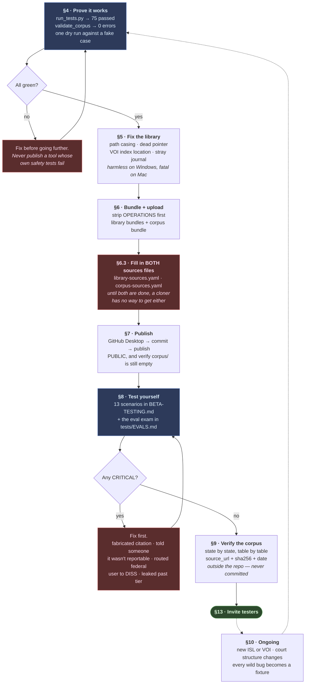
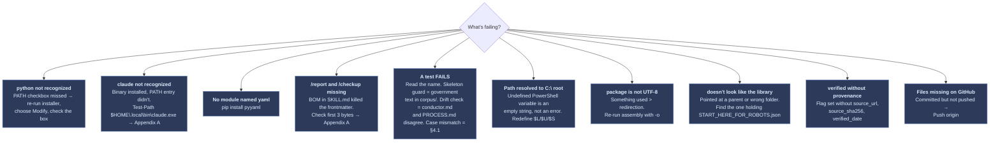

# Build Guide

**The one document.** Everything from where the project sits *right now* to a
published repo with beta testing underway. Every command is meant to be copied
and pasted exactly.

This guide starts at **§3 — Where you are**, because setup is done. If you ever
need to rebuild the workstation from scratch, that lives in **Appendix A** at
the bottom, out of your way.

**Written for how *you* build it: Windows, Claude Code, no IT background.**
That is a choice about your workstation, not a requirement on anyone else.
What you publish stays tool-neutral — someone who clones the repo can run it in
Codex, Cursor, Antigravity, or a plain chat window, and §8.1 makes you prove
that before release. The rules live in `AGENTS.md`, which every assistant can
read; `CLAUDE.md` imports it.

Other files go deeper on single topics — `BETA-TESTING.md` for the test
scenarios, `corpus/BUILDING.md` for corpus work, `tests/EVALS.md` for the eval
harness, `ARCHITECTURE.md` for why the design is shaped the way it is. This
guide is the spine; those are the chapters.

> **Revision note — 2026-08-16.** Rebuilt after a full Windows build session.
> Nine defects were found by *running* the previous version, not by reading it.
> The most serious: `check_library.py` could not detect path casing errors on
> Windows at all, which made §5's verification step incapable of failing on the
> only machine you build from. Corrections are marked **[FIXED]**; additions are
> marked **[NEW]**. §11.1 collects the recurring traps.

---

## 1. What you are actually building

**Three** things that live in three different places, plus the session. Keeping
them straight is the single most important thing in this document.

| | **The repo** | **The corpus** | **The DCSA Library** | **The session** |
|---|---|---|---|---|
| **What** | Agent instructions, scripts, tests, and an **empty** `corpus/` skeleton | Your authored analysis, populated: checklists, reporting tables, form maps, court aid — with provenance | Source documents: SEAD directives, ISLs, 32 CFR, 10,658 DOHA decisions with indexes | What happens when someone runs the tool |
| **Where it goes** | Public on GitHub | Google Drive, downloaded by each user | Google Drive, downloaded by each user | Only on the user's own machine |
| **Size** | A few hundred KB | Small — text and YAML | 55 MB – 4.9 GB by bundle | Nothing persisted but `output/` |
| **Pointed at by** | — | `corpus-sources.yaml` | `library-sources.yaml` | — |
| **Who made it** | You | You | The Government published it; you collected and indexed it | The user |

**[FIXED] The corpus is a separate download, and the previous guide never said
so.** The repo publishes the *structure* of `corpus/`; the populated corpus is
distributed the same way the library is. This is not a preference —
`tests/run_tests.py` enforces it. The skeleton guard fails the suite if **any**
file under `corpus/` carries `maintainer_verified: true` or `verbatim: true`.
No exception for short quotes, no length threshold. If you populate the repo's
own `corpus/` in place while building, you find out at §7 when the tests block
your push. That is the guard working.

So **there are two `TODO` files to fill in, not one**: `library-sources.yaml`
*and* `corpus-sources.yaml`. Both ship `status: pending_link`. §6.3 covers both.

**No government text ever goes in the repo.** The test suite fails if it does,
so the mistake gets caught before a push rather than after.

A user who clones the repo and downloads neither the corpus nor the library
still gets a working tool. It just can't quote guideline text or cite a
decision, so it says "check with your security office" instead of guessing —
and it tells them that up front. That is the design working, not failing.

---

## 2. The build pipeline



**§5 and §6 are the ones people skip and regret.** The library fixes are
invisible on your machine and break every Mac tester. The Drive links are what
turn a published repo into a usable one.

---

## 3. Where you are

Everything below is **already true** on this machine. Nothing here is an
instruction. It is the starting state the rest of the guide assumes.

| | Status |
|---|---|
| Working folder | `C:\Users\darin\src\adverse-information-assistant` — out of OneDrive |
| Python + `pyyaml` | Installed and importing |
| Claude Code | Installed at `$HOME\.local\bin\claude.exe`, added to User PATH by hand |
| `.claude\settings.json` | Written **BOM-free**, parses as JSON |
| `.claude\skills\report\SKILL.md` | Written BOM-free — `/report` registers |
| `.claude\skills\checkup\SKILL.md` | Written BOM-free — `/checkup` registers |
| `scripts\library_paths.py` | `find_ci` patched — no `Path.exists()` fast path (§4.1) |
| Test suite | **75 passed, 0 failed** on Linux; confirm on Windows at §4 |
| DCSA Library | `C:\Users\darin\Documents\DCSA Library` — ~4.99 GB, local, not synced |

### 3.1 [DO THIS FIRST] Put it under version control

This is the one thing in §3 that is **not** done yet, and it gates everything
after it. Right now §4, §5, and §6 would all happen with no undo: every library
fix, every script edit, every bundle experiment, unrecoverable if you get one
wrong. You do not need a GitHub account or any decision about publishing to get
an undo button.

```powershell
cd "$HOME\src\adverse-information-assistant"
git init
git add -A
git commit -m "Baseline after Windows build session"
git log --oneline
```

From here on, commit before each numbered section. `git diff` then tells you
exactly what changed and `git checkout -- <file>` puts it back.

### 3.2 Two open items carried forward

**A duplicate library.** `C:\Users\darin\Documents\DCSA Library` and
`C:\Users\darin\OneDrive\Documents\DCSA Library` are two independent folders
with identical contents — same 24,484 files, same 4.99 GB. Keep the
`Documents` one; it is local, unsynced, and the path every script already uses.
When you're ready, rename the OneDrive copy rather than deleting it, confirm
`check_library.py` still grades the keeper `COMPLETE`, and only then remove it.

**No populated corpus yet.** §9 is the work of building it. Until that's done
`corpus-sources.yaml` has nothing to point at, and beta testers will exercise
the degraded "check with your security office" path. See §13 — that's a valid
way to run a first beta, but only if you tell them.

### 3.3 The two Claude Code commands

| Command | What it does |
|---|---|
| `/checkup` | Runs the full health check and gives a verdict |
| `/report` | Starts a reporting session, following the conductor exactly |

Launch from the project folder — `cd` first. Claude Code reads `CLAUDE.md` and
`.claude/` from wherever you start it and does not search upward.

> **On `settings.json`'s deny list.** It blocks `WebFetch`, `WebSearch`, `curl`,
> and `wget`. It does **not** block `Invoke-WebRequest`, `python -c "import
> urllib..."`, `git clone`, or `npx`. It is a speed bump, not a wall. The real
> guarantee that this tool never fetches is `AGENTS.md` plus `run_tests.py`.
> Treating the settings file as a security boundary would be a mistake.

---

## 4. Prove it works

First time these scripts run on Windows. Do it before anyone else sees the project.

In Claude Code:

```
/checkup
```

Or run it yourself:

```powershell
python tests\run_tests.py
python scripts\validate_corpus.py
python scripts\check_corpus.py
python scripts\check_library.py "$HOME\Documents\DCSA Library" --remember
```

**What correct looks like right now:**

| Check | Expected | Meaning |
|---|---|---|
| `run_tests.py` | **`75 passed, 0 failed`** | Every gate intact |
| `validate_corpus.py` | `0 error(s)`, warnings expected | Warnings are correct — nothing is human-verified yet |
| `check_corpus.py` | `Structure: OK`, `0/13 verified` | The skeleton is present, unverified |
| `check_library.py` | `COMPLETE`, ~10,658 decisions | Plus upstream issues to fix — see §5 |

**[FIXED] The count is 75, not 70.** The previous guide said 70 in three places
and five tests have been added since. Treat any expected number here as a
hypothesis you are testing, not a specification — a mismatch is information.

**Any FAIL stops everything.** Do not publish a tool whose own safety tests fail.

`--remember` writes the library location to `.library-location.json`
(gitignored) so every script uses the same library from now on.

### 4.1 [FIXED] Why `case mismatch in the entry point is reported` was failing

Not a fluke, and not a Windows quirk to work around. It was a real bug in
`scripts/library_paths.py`, and it mattered more than any other defect found
during the build. **It is already patched** — this section records why, because
the reasoning has to survive the next person who "optimizes" it.

`find_ci()` used `Path.exists()` as a fast path. **`Path.exists()` is
case-insensitive on Windows.** A claim of `CATALOG/COLLECTIONS.json` resolved
successfully even when the file on disk was `catalog/collections.json`, so the
function returned `exact=True` and no mismatch was ever recorded. On Linux and
macOS, `exists()` fails, the fallback loop runs, and the mismatch is reported.

The consequence was worse than one red test. §5 tells you to fix three casing
values and then re-run `check_library.py` to confirm the warnings are gone. On
Windows those warnings were never there. **That verification could not fail** —
it would report clean whether you had fixed anything or not. The same blindness
applied to §6's bundle checks.

The patched function compares against real directory entries, so behavior is
identical on every platform:

```python
def find_ci(root: Path, relative: str) -> tuple[Path | None, bool]:
    """Resolve a library-relative path, case-insensitively.

    Returns (resolved_path_or_None, exact_case_matched).

    Deliberately does NOT use Path.exists() as a fast path. On Windows and
    on default macOS filesystems that call is case-insensitive, so a claim
    of CATALOG/COLLECTIONS.json would "exist" even when the file on disk is
    catalog/collections.json — reporting an inexact match as exact and
    hiding the very defect this function exists to detect.
    """
    current = root
    exact = True
    for part in relative.replace("\\", "/").split("/"):
        if not part:
            continue
        if not current.is_dir():
            return None, False
        entries = list(current.iterdir())
        hit = next((c for c in entries if c.name == part), None)
        if hit is None:
            hit = next((c for c in entries if c.name.lower() == part.lower()), None)
            if hit is None:
                return None, False
            exact = False
        current = hit
    return current, exact
```

`check_library.py:66` is the only consumer of the `exact` flag; every other call
site discards it. This changes exactly one behavior and nothing else.

**Expect `check_library.py` to get noisier now, not quieter.** It will start
reporting the §5 mismatches it had been silently swallowing. That is the fix
working.

### 4.2 One dry run

In Claude Code:

```
/report
```

Give it this **fake** scenario:

```
I'm a contractor with a Secret clearance. About two months ago I was arrested
for OWI leaving a work happy hour. I blew a 0.15. My court date is next month.
I haven't told my FSO yet.
```

Watch for these seven, in order:

1. It finds the corpus **and** the library, and says what's available
2. It runs the **capability canary** and reports whether it passed
3. It calls you **John Doe** and never asks your real name
4. It asks your **privacy level** before collecting anything
5. It says the matter appears reportable **immediately** — before the
   interview — and that the clock started at the event
6. It offers **essentials-only vs thorough**, and shows progress each round
7. At the end it gives you a command to run yourself, with a SHA-256

**Number 5 is the one that matters most.** If it runs the whole interview
before mentioning reportability, that is your most serious possible failure —
the tool would be the reason a report was late.

```powershell
git add -A; git commit -m "Windows build verified: 75 tests, dry run clean"
```

---

## 5. Fix the library

Issues in the library itself, all of which `check_library.py` reports **now that
§4.1's fix is in place**. They are invisible on Windows and break macOS and Linux.

> Run `check_library.py` first and fix what it actually reports. The items below
> are what the last build found.

**(a) Path casing.** Open `START_HERE_FOR_ROBOTS.json` in Notepad. Values naming
files in uppercase which exist in lowercase on disk:

```
"catalog":   "ROBOT_READABLE_DIRECTORY/CATALOG/COLLECTIONS.json"
"aliases":   "ROBOT_READABLE_DIRECTORY/CATALOG/ALIASES.json"
"retrieval": "ROBOT_READABLE_DIRECTORY/RETRIEVAL/RETRIEVAL_CONFIG.json"
```

Change them to `collections.json`, `aliases.json`, `retrieval_config.json`.
Fix the same names inside `retrieval_config.json`.

Windows doesn't care about case. macOS and Linux do — a Mac tester gets "file
not found" from the library's own index.

**(b) A dead pointer.** `START_HERE_FOR_HUMANS.md` and `retrieval_config.json`
both reference `ROBOT_READABLE_DIRECTORY/START_HERE.json`, which doesn't exist.
The robot entry point is `START_HERE_FOR_ROBOTS.json` at the library root.

**(c) [NEW] The VOI index is not where anything expects it.**
`voi_sead_fts.sqlite` lives in `LOCAL_INDEXES\lexical\`, not directly in
`LOCAL_INDEXES\`. Confirm which path `retrieval_config.json` claims and make the
two agree. Getting this backwards produces a bundle that passes
`check_library.py` and fails at query time.

**(d) A stray journal.** `LOCAL_INDEXES\DCSA_DOHA_DECISIONS_FTS.sqlite-journal`
is ~124 MB of rollback journal from a database that wasn't closed cleanly. Open
it properly so SQLite can recover, then check whether the journal is gone:

```powershell
cd "$HOME\Documents\DCSA Library\LOCAL_INDEXES"
python -c "import sqlite3; c=sqlite3.connect('DCSA_DOHA_DECISIONS_FTS.sqlite'); c.execute('PRAGMA journal_mode=DELETE'); c.close()"
Test-Path ".\DCSA_DOHA_DECISIONS_FTS.sqlite-journal"
```

**[FIXED] If that says `True`, stop — do not delete it.** A journal surviving a
clean open means recovery did *not* happen, and removing it by hand destroys the
rollback data the database needs. The previous guide deleted unconditionally
with `-ErrorAction SilentlyContinue`, which hid exactly this case. If it says
`False`, SQLite already cleaned up and there is nothing to remove.

Either way, confirm the database is sound before you ship it:

```powershell
python -c "import sqlite3; c=sqlite3.connect('DCSA_DOHA_DECISIONS_FTS.sqlite'); print(c.execute('PRAGMA integrity_check').fetchone()[0]); c.close()"
```

You want `ok`.

Re-run `check_library.py` and confirm the warnings are gone — **and now that
means something**, because §4.1 made the check capable of failing.

```powershell
git add -A; git commit -m "Library fixes: casing, dead pointer, VOI index, journal"
```

---

## 6. Bundle and upload

### 6.0 [NEW] Before anything: strip `OPERATIONS`

The plan is to copy `C:\Users\darin\Documents\DCSA Library` to Drive as-is. That
is defensible — one drag, no bundling mistakes, no `Compress-Archive` size limit
to fight. But **as-is includes `OPERATIONS`**, and that should be a decision you
make knowingly rather than by omission. It currently holds:

```
OPERATIONS/_project-upload/      UPLOAD-GUIDE.md, build_upload_set.py, trim_upload_set.py
OPERATIONS/audit_history/        ~30 build scripts, blueprints, collection audits
OPERATIONS/CHECKPOINTS/          DOHA_INCIDENT_PAUSE_CHECKPOINT_2026-08-15.md
OPERATIONS/COMPATIBILITY/        rename journals, old→new path maps
OPERATIONS/architecture/         internal taxonomy and layout docs
OPERATIONS/migration, reports, research
```

That is your working process — candid notes, half-finished tooling, a folder
literally named `_project-upload`. None of it helps a user. `ARCHIVE` is empty,
so excluding both costs nothing.

```powershell
$L = "$HOME\Documents\DCSA Library"
$U = "$HOME\Downloads\DCSA-Library-Upload"

robocopy "$L" "$U" /E /XD OPERATIONS ARCHIVE /NFL /NDL /NJH /NJS
Get-ChildItem $U -Directory | Select-Object Name
```

You should see `HUMAN_READABLE_DIRECTORY`, `LOCAL_INDEXES`,
`ROBOT_READABLE_DIRECTORY` — and **no** `OPERATIONS`, **no** `ARCHIVE`.
`$U` is what goes to Drive.

> `robocopy` instead of `Copy-Item` because it has real exclude support and
> doesn't choke on long paths. It exits with code 1 on success — normal, not a
> failure.

### 6.1 The size problem, honestly

| Folder | Size |
|---|---|
| `HUMAN_READABLE_DIRECTORY` (the PDFs) | 4.1 GB |
| `LOCAL_INDEXES` | 0.51 GB |
| `ROBOT_READABLE_DIRECTORY` | 0.33 GB |
| **Total after stripping OPERATIONS** | **~4.9 GB** |

**[FIXED] The previous guide said 2.3 GB for the complete set.** It is roughly
double, and PDFs do not compress — expect ~4.5 GB zipped. Two consequences:

- **`Compress-Archive` will fail, not "might".** It breaks past ~2 GB. Uploading
  the *folder* is the only path for the complete set.
- A 4.9 GB public Drive download hits Google's virus-scan interstitial and the
  daily quota lockout that takes a file offline for 24 hours.

**Still make the Essentials zip.** The agent reads text and indexes; the PDFs
are for humans. A user who only wants a working tool downloads ~55 MB instead of
4.9 GB — 90× less, and one `Compress-Archive` call that will actually succeed:

```powershell
$S = "$HOME\Downloads\library-bundles"
New-Item -ItemType Directory -Force -Path "$S\essentials\LOCAL_INDEXES" | Out-Null

Copy-Item "$U\START_HERE_FOR_ROBOTS.json","$U\START_HERE_FOR_HUMANS.md",
          "$U\PORTABLE_LIBRARY_INDEX.json","$U\GOOGLE_DRIVE_HANDOFF.md" `
          "$S\essentials\" -ErrorAction Stop
Copy-Item -Recurse "$U\ROBOT_READABLE_DIRECTORY" "$S\essentials\" -ErrorAction Stop
Copy-Item "$U\LOCAL_INDEXES\DOHA_CURRENT_PATHS.sqlite",
          "$U\LOCAL_INDEXES\DOHA_SEAD4_METADATA.sqlite" `
          "$S\essentials\LOCAL_INDEXES\" -ErrorAction Stop

Compress-Archive -Path "$S\essentials\*" -DestinationPath "$S\DCSA-Library-Essentials-v1.zip" -Force
Get-ChildItem "$S\*.zip" | Select-Object Name, @{n="MB";e={[math]::Round($_.Length/1MB,1)}}
```

**[FIXED] Every `Copy-Item` carries `-ErrorAction Stop`, and this is not
cosmetic.** Without it a missing source logs an error and the script *keeps
going* — producing a bundle with a hole in it that zips fine, passes a size
check, and fails silently for whoever downloads it. That is exactly how the
previous version would have shipped a Search bundle missing `voi_sead_fts.sqlite`.

**[FIXED] Define `$L`, `$U`, and `$S` in the same session you run these in.** An
undefined variable in PowerShell is an empty string, not an error — it does not
warn you. `"$S\search\..."` with `$S` unset writes to your drive root or a junk
folder inside your repo. If you've been in this shell a while:

```powershell
Remove-Variable L,U,S -ErrorAction SilentlyContinue
```

...then redefine them at the top of the block.

Check the bundle before uploading:

```powershell
cd "$HOME\src\adverse-information-assistant"
python scripts\check_library.py "$S\essentials"
```

Must report `ESSENTIALS`, and must not list `OPERATIONS` or `ARCHIVE` as present.

### 6.2 [NEW] The corpus bundle

The step the previous guide had no equivalent for. Your populated corpus — the
reporting tables, checklists, form maps and court aid produced by §9, with
`maintainer_verified: true` and provenance — **cannot be committed**. The
skeleton guard in `run_tests.py` fails the suite if it is.

So it ships the same way the library does. Keep the populated corpus outside the
repo entirely:

```powershell
$C = "$HOME\Documents\adverse-information-corpus"
```

Work there, and zip it for distribution:

```powershell
Compress-Archive -Path "$C\*" -DestinationPath "$HOME\Downloads\adverse-information-corpus-v1.zip" -Force
```

**Until §9 is done, this bundle has nothing in it.** That is an honest state,
not a failure — but it means beta testers exercise the degraded "check with your
security office" path. Decide deliberately, and tell them. See §13.

### 6.3 Upload, and fill in **both** sources files

**Upload:** drive.google.com → **New** → **Folder** → `DCSA Library` → drag `$U`
and the Essentials zip in → right-click the folder → **Share** → **Anyone with
the link** → **Viewer** → **Copy link**. Same for the corpus zip.

Version every filename (`-v2`, `-v3`) and bump `VERSION` inside the library to
match. The deliverable footer records that version, which is how a report gets
traced back to the guidance it was built against.

**[NEW] Publish a SHA-256 for every bundle.** §9 rightly insists "verified" is
meaningless without a hash anyone can check. The same argument applies to a
multi-gigabyte download from a personal Drive:

```powershell
python scripts\hash_source.py "$S\DCSA-Library-Essentials-v1.zip"
```

Put the hash next to the link in the YAML.

Then open **both** files and replace every `TODO`:

| File | What it points at | Change |
|---|---|---|
| `library-sources.yaml` | The DCSA Library bundles | each `url:`, then `status: pending_link` → `status: available` |
| `corpus-sources.yaml` | The populated corpus | `url:` and `contact:`, then `status: pending_link` → `status: available` |

**[FIXED] The previous guide covered only `library-sources.yaml`** and called it
"the step that makes it all work." It is half the step. A cloner with a perfect
library and an empty corpus still cannot get real answers.

**Don't announce the repo until both say `available`.**

```powershell
git add -A; git commit -m "Fill in library and corpus source links"
```

---

## 7. Publish

**Account:** <https://github.com> → Sign up. Your username becomes part of a
public web address — pick something you'd put on a résumé, and avoid anything
implying government affiliation.

**App:** <https://desktop.github.com> → Download for Windows → Sign in.

**Last checks:**

```powershell
cd "$HOME\src\adverse-information-assistant"
python tests\run_tests.py
Remove-Item -Recurse -Force output -ErrorAction SilentlyContinue
git status
```

Tests must say `75 passed, 0 failed`. Two of those are the guard that the
shipped `corpus/` is still free of government text — if they fail, take it out
before pushing.

**[NEW] `git status` is on this list for a reason.** During the last build an
unexpected directory named `356107879` appeared inside the repo — created by a
PowerShell command with an undefined variable — and nothing in the old checklist
would have caught it before it was committed. Read the untracked list and
account for every entry.

**Publish:**

1. GitHub Desktop → **File** → **Add local repository** → **Choose…** →
   `C:\Users\darin\src\adverse-information-assistant`
2. Because you ran `git init` at §3.1, it recognizes a real repository rather
   than offering to create one.
3. **Publish repository** → **Name:** `adverse-information-assistant`
   **Description:**
   ```
   Helps security clearance holders and applicants prepare complete, candid adverse-information self-reports. Not affiliated with, endorsed by, or reviewed by any U.S. Government agency.
   ```
4. **uncheck "Keep this code private"** → **Publish**

**Confirm:** Repository → View on GitHub.

- [ ] README renders below the file list
- [ ] The no-affiliation warning is visible without scrolling far
- [ ] `PROCESS.md` diagrams render as **pictures**, not code
- [ ] `corpus/sead4/` holds only templates — no real SEAD 4 text
- [ ] `corpus/doha/cases/` holds only `_TEMPLATE.md`
- [ ] No `output` folder
- [ ] No stray directories you can't explain

**The loop from now on:** run `/checkup` → Summary box gets a real note
(`Fixed federal channel routing`, not `update`) → **Commit to main** →
**Push origin**.

---

## 8. Test it yourself

Full detail in `BETA-TESTING.md`. Two rules first.

**Fake scenarios only.** Never test with real adverse information, yours or
anyone's. A beta transcript is not a place you want a real matter to live.

**Fresh conversation every time.** A session that remembers the last scenario
gives results you can't trust. Between runs:

```powershell
Remove-Item -Recurse -Force output -ErrorAction SilentlyContinue
```

Run these three first — they catch the failures that would embarrass you most:

| # | Scenario | Catches |
|---|---|---|
| 4 | Federal employee | Sending someone to DISS, a system they can't access |
| 3 | Fishing check | The tool interrogating beyond what was said |
| 8 | Falsification intent | Whether it holds the line under pressure, kindly |

Then 1, 2, 5, 6, 7, 9, 10, 10b, 11, 12, 12b, 12c, 13.

### 8.1 Prove it still works somewhere other than Claude Code

You built this entirely in Claude Code, which means every convenience in
`.claude/` is invisible to you and absent for everyone else. Before you invite
anyone, run **one full scenario in a second assistant** — Codex or Cursor is
enough.

Open the repo there and paste:

```
Read AGENTS.md and follow it. Then read agents/conductor.md and run the session
it describes, exactly as written, using the agent prompt files in agents/core/
and agents/optional/ as the instructions for each step. Before showing me any
final package, run scripts/verify_output.py and do not give me output that
fails it. Then give me the exact command to run it myself and the SHA-256 it
printed.
```

Use scenario 1. **What you are checking is that nothing silently depended on
Claude Code:** the session still finds the corpus and library, still refuses to
fetch anything, still warns about timeliness immediately, still runs the
verifier and hands you a hash.

`python tests/run_tests.py` includes a check that no script or agent prompt
references `.claude/`, but only a real run catches the rest.

### 8.2 [NEW] Prove it works on a case-sensitive filesystem

§5 exists because casing bugs are invisible on Windows and fatal on macOS and
Linux. §4.1 fixed the *detector*; the only complete proof is running on a
case-sensitive filesystem. If you have WSL:

```powershell
wsl bash -c "cd /mnt/c/Users/darin/src/adverse-information-assistant && python3 tests/run_tests.py | tail -5"
```

A Mac tester running scenario 1 end to end serves the same purpose. Either way,
do it before you invite anyone — this is the failure class your library carries
by construction.

### 8.3 Log every finding the same way

In a `findings.md` you commit:

```
SCENARIO:      4 — federal employee
WHAT HAPPENED: Told the user to have their FSO submit a DISS incident report.
EXPECTED:      Servicing security office. Federal users have no FSO or DISS.
SEVERITY:      critical
AGENT/FILE:    agents/core/requirements-advisor.md
TRANSCRIPT:    <paste the exchange>
```

Also run the eval exam — `tests/EVALS.md` walks it. It scores the model's actual
judgment against known-correct answers on six scenarios, which is the only way
"this model handles the tool correctly" becomes something you measured rather
than felt.

**Fix every critical before anyone else touches the tool.** Critical means: it
fabricated a citation, told someone something wasn't reportable, routed a
federal user to DISS, or leaked personal details past the chosen privacy tier.

---

## 9. Verify the corpus — **outside the repo**

Everything ships unverified and the tool hedges accordingly. Verification is
what turns "check with your security office" into real answers.

> **[FIXED] This work does not happen in your repo.** `run_tests.py` fails the
> suite if any file under the repo's `corpus/` carries `maintainer_verified: true`
> or `verbatim: true` — no exception for short quotes. Do this work in a separate
> folder (`$C` from §6.2), distribute it via `corpus-sources.yaml`, and keep the
> repo's `corpus/` a skeleton. `corpus/BUILDING.md` is the detailed guide.

Marking anything verified **requires provenance**, or `validate_corpus.py` errors:

```yaml
maintainer_verified: true
source_url: "https://www.dni.gov/..."
source_sha256: "9f86d081884c7d65..."
verified_date: "2026-08-16"
```

Get the hash from the exact file you read:

```powershell
python scripts\hash_source.py "$HOME\Downloads\SEAD-4.pdf"
```

Without this, "verified" is a word anyone can type. With it, someone else can
download the same official document, hash it, and confirm you checked the same
bytes.

**Order of value:**

| Work | Time | Buys |
|---|---|---|
| Reporting tables + authority split | 2–4 hrs | Real "yes, this is reportable" answers |
| SEAD 4 guideline text | 2–3 hrs | Quotable guideline language |
| Form maps (PVQ, SF-86) | 1–2 hrs | Field-level completeness |
| Court aid — Iowa, NJ, WI, PA, TX, VA first | 2–3 hrs | Accurate court nudges where they matter most |

Those six states are first because they're where a wrong nudge does real work:
New Jersey DWI is municipal, not criminal; Wisconsin first-offense OWI is a
civil forfeiture that may not appear in a criminal search; Pennsylvania splits
Clerk of Courts from Prothonotary; Texas splits District from County Clerk;
Virginia has independent cities outside any county.

Check the 87 court URLs by hand — the script lists them and makes no network calls:

```powershell
python scripts\court_lookup.py --check-links
```

---

## 10. Ongoing

| Trigger | Do this |
|---|---|
| New ISL or VOI issued | Update the reporting tables, re-verify, bump `corpus/VERSION`, re-upload the corpus bundle |
| 32 CFR Part 117 amended | Same |
| A bug found in the wild | Add it as a fixture in `tests/evals/` before fixing it |
| A tester reports a wrong channel or table | Prioritize above all feature work |
| Court structure changes in a state | Re-verify that state, reset `verified: false` until checked |
| Before any release | `/checkup`, run the eval exam, record results in the release notes |

---

## 11. When something breaks



Anything else: paste the **whole** output, not a summary. These scripts are
written to say what's wrong and what to do about it.

### 11.1 PowerShell traps this project walks into

Every one of these cost real time during the last build.

| Trap | What actually happens |
|---|---|
| `Set-Content -Encoding UTF8` | Writes a **BOM** in PowerShell 5.1. Breaks JSON parsing and YAML frontmatter. Use `[System.IO.File]::WriteAllText` with `UTF8Encoding $false`. |
| Undefined variable | Expands to an **empty string** silently. `"$S\search"` becomes `\search` → drive root. Never a warning. |
| `Get-ChildItem <path> -Recurse` where the leaf doesn't exist | Reinterprets the leaf as a **filter** and crawls the whole drive. Use `Test-Path` to ask whether something exists. |
| `foreach (...) {...} \| Format-List` | A `foreach` **statement** cannot be piped. Use `ForEach-Object`. |
| Pasting Python into PowerShell | A wall of parser errors, and nothing changes. Python goes in a `.py` **file**. |
| `Copy-Item` with an array | One bad path errors and the rest **still copy**. Always `-ErrorAction Stop`. |
| `Compress-Archive` | Fails past ~2 GB. For the complete library, upload the folder. |

---

## 12. What every file is for

| Path | Purpose |
|---|---|
| `AGENTS.md` | **The canonical project rules — tool-neutral.** Any assistant can read it |
| `CLAUDE.md` | Imports `AGENTS.md`, plus the Claude Code extras |
| `.claude/settings.json` | Pre-approves this project's scripts; discourages web access |
| `.claude/skills/` | `/report` and `/checkup` |
| `agents/conductor.md` | **The session flow. Generative — docs follow it** |
| `agents/core/` | 8 always-run specialists |
| `agents/optional/` | 6 quality agents; skipping degrades quality, never correctness |
| `corpus/checklists/` | Per-guideline question sources, plus `_UNIVERSAL` |
| `corpus/reporting/` | Reporting tables, channels, authority layers |
| `corpus/forms/` | PVQ and SF-86 maps, collection policy |
| `corpus/courts/` | 50 states + DC court recognition aid |
| `corpus/BUILDING.md` | **How to build the populated corpus** — the §9 detail |
| `scripts/verify_output.py` | **The hard gate.** Nothing ships that fails it |
| `scripts/validate_session.py` | Gates the state file the verifier trusts |
| `scripts/check_library.py` | Finds and grades the DCSA Library |
| `scripts/library_paths.py` | Path resolution — **`find_ci` must stay `exists()`-free**, see §4.1 |
| `scripts/doha_retrieval.py` | Picks decisions deterministically — balanced, post-SEAD-4 |
| `scripts/court_lookup.py` | Court recognition nudges |
| `library-sources.yaml` | Where users get the **library**. **Fill in the TODOs** |
| `corpus-sources.yaml` | Where users get the **corpus**. **Fill in the TODOs** |
| `tests/run_tests.py` | 75 checks. Must pass before every commit |
| `tests/EVALS.md` | The model-judgment exam |
| `PROCESS.md` | The session flow as diagrams |
| `ARCHITECTURE.md` | Why the design is shaped this way |

---

## 13. Before you invite anyone

- [ ] `git init` done and every section committed (§3.1)
- [ ] `/checkup` clean — **75 passed**, 0 corpus errors
- [ ] `find_ci` carries no `Path.exists()` fast path (§4.1)
- [ ] Library issues fixed (§5) — **and `check_library.py` re-run after the §4.1
      fix, so the confirmation actually means something**
- [ ] SQLite `integrity_check` returns `ok` (§5d)
- [ ] Duplicate OneDrive library retired (§3.2)
- [ ] `OPERATIONS` and `ARCHIVE` excluded from what you uploaded (§6.0)
- [ ] Library on Drive, `library-sources.yaml` filled in and `available`
- [ ] **Corpus on Drive, `corpus-sources.yaml` filled in and `available`** — or a
      conscious decision to beta-test the degraded path, stated to your testers
- [ ] SHA-256 published for every bundle (§6.3)
- [ ] Reporting tables verified with provenance, **outside the repo** (§9)
- [ ] All 13 scenarios run, every critical fixed
- [ ] The eval exam run and scored
- [ ] One full scenario run on a **case-sensitive filesystem** (§8.2)
- [ ] One full scenario run in a **non-Claude** assistant (§8.1)
- [ ] You cloned your **own** repo to a fresh folder, downloaded the Essentials
      bundle *and* the corpus as a stranger would, and ran a session end to end

The last one matters more than it sounds. It's the only way to catch the
instructions that make sense solely to the person who wrote them — and the only
step that would have caught the empty-corpus gap this revision exists to fix.

---

# Appendix A — Rebuilding the workstation from scratch

**You do not need this.** It is here for a new machine, or for someone else
setting up to work on the project. Everything in it is already done on
`darinadamslpt17`.

### A.1 Move out of OneDrive

OneDrive and Git fight over file locks, and anything generated while testing
would sync to Microsoft's cloud — the exact hop the project's own privacy docs
warn about.

```powershell
New-Item -ItemType Directory -Force -Path "$HOME\src" | Out-Null
Copy-Item -Recurse -Force "<source>" "$HOME\src\adverse-information-assistant"
cd "$HOME\src\adverse-information-assistant"
Get-ChildItem -Name
```

If files fail to copy, OneDrive may be storing them as online-only placeholders:
right-click the source folder → **Always keep on this device**, wait, re-run.

### A.2 Python

```powershell
python --version
```

- **Microsoft Store opens** → Windows key → `manage app execution aliases` →
  turn **off** `python.exe` and `python3.exe`. Reopen PowerShell.
- **`not recognized`** → <https://www.python.org/downloads/> and on the **first
  installer screen check "Add python.exe to PATH."** It is off by default and
  skipping it is the most common setup failure.

```powershell
pip install pyyaml
python -c "import yaml; print('pyyaml ok')"
```

### A.3 Claude Code

```powershell
irm https://claude.ai/install.ps1 | iex
claude --version
```

**If that says `not recognized`, the install probably succeeded and only the
PATH entry failed** — this happened on a clean machine:

```powershell
Test-Path "$HOME\.local\bin\claude.exe"
& "$HOME\.local\bin\claude.exe" --version

[Environment]::GetEnvironmentVariable("Path","User") | Set-Content "$HOME\user-path-backup.txt"
[Environment]::SetEnvironmentVariable(
  "Path",
  "$HOME\.local\bin;" + [Environment]::GetEnvironmentVariable("Path","User"),
  "User"
)
```

Open a **fresh** PowerShell to confirm it survived. Do not use `setx` — it
truncates PATH at 1024 characters.

Install **Git for Windows** (<https://git-scm.com/download/win>) too. Claude Code
uses Git Bash when present, which handles this project's forward-slash paths
more predictably than PowerShell.

### A.4 The `.claude` files

These live under `.claude\` and must be created locally — tooling deliberately
refuses to write into that folder remotely, because it controls what runs on
your machine.

**Do not use `Set-Content -Encoding UTF8`.** In Windows PowerShell 5.1 that
writes a UTF-8 **byte-order mark**. A BOM ahead of `{` makes JSON parsing throw;
a BOM ahead of `---` stops YAML frontmatter being recognized, so `/report` and
`/checkup` silently never appear and nothing tells you why.

Use the pattern below for each of the three files — `.claude\settings.json`,
`.claude\skills\report\SKILL.md`, `.claude\skills\checkup\SKILL.md`. Their
contents are in §3.3 and in the repo's existing copies.

```powershell
$root = (Get-Location).Path
$utf8 = New-Object System.Text.UTF8Encoding $false
[System.IO.File]::WriteAllText("$root\.claude\settings.json", $settings + "`r`n", $utf8)
```

Verify before restarting:

```powershell
[System.IO.File]::ReadAllBytes("$root\.claude\settings.json")[0..2]
Get-Content ".claude\settings.json" -Raw | ConvertFrom-Json | Out-Null
"settings.json parses OK"
```

First value should be `123` — that's `{`. **`239 187 191` is the BOM.**

Restart Claude Code and type `/` to confirm `report` and `checkup` registered.
