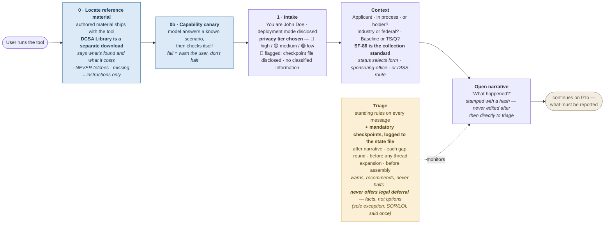
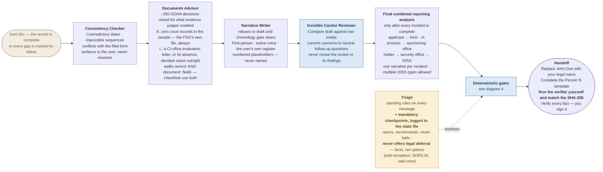
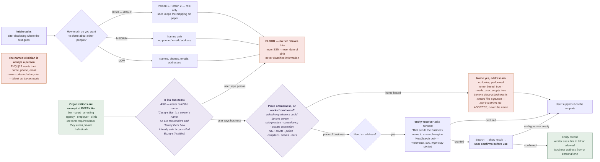
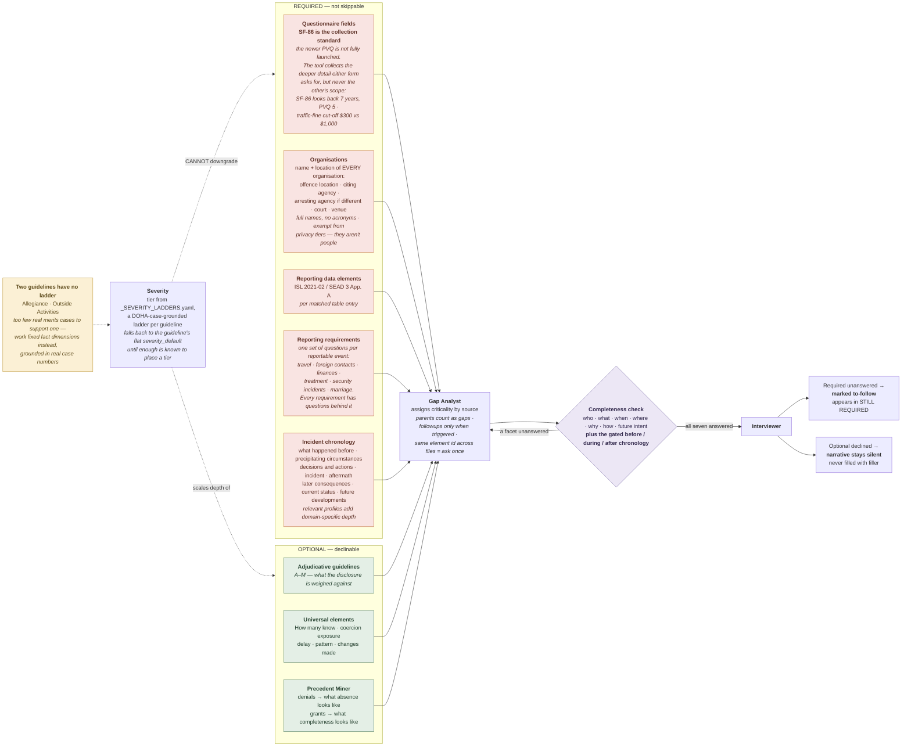
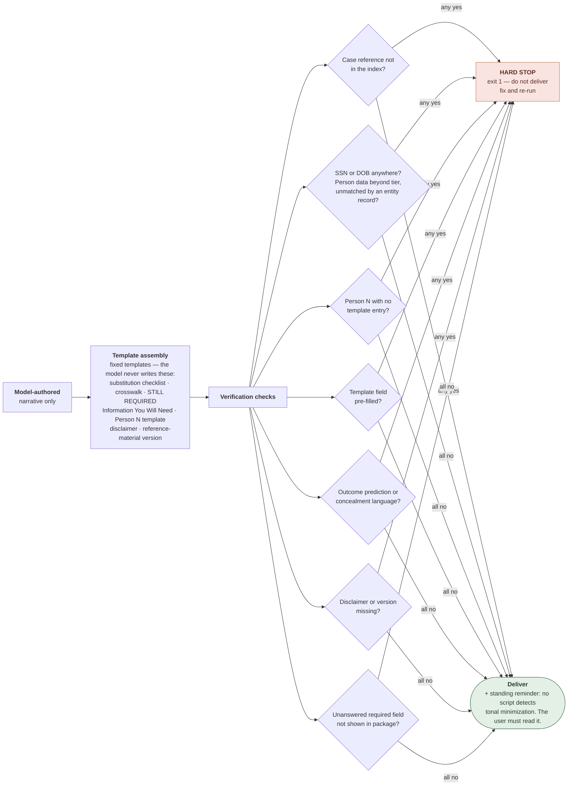
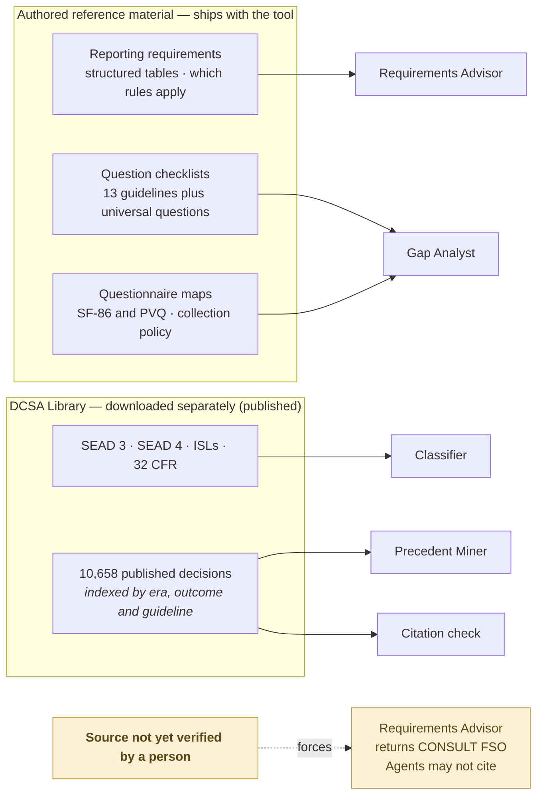
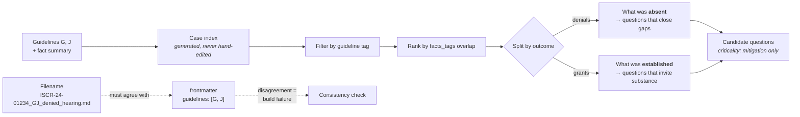

# Process Map

How a session actually runs, what grounds each decision, and where the
guarantees are enforced.

> **`agents/conductor.md` is the generative source of the flow** — it is what
> the agents actually execute. This file renders and explains it. If the two
> disagree, conductor.md wins and this file is wrong;
> `tests/run_tests.py` includes a drift check that fails when the stage
> orders diverge.
>
> **To actually look at the diagrams**, open
> [`docs/process-map.html`](docs/process-map.html) — double-click it, no server
> needed. Regenerate it after editing this file:
> `python scripts/render_process_map.py`. A test fails if it goes stale.

## 1. Session flow
<!-- eyebrow: HOW A SESSION RUNS | headline: One matter at a time, from the user's own words to a report they sign. | standfirst: The flow is staged so the user always knows where they are, why a question is being asked, and what happens next. -->

**01a · Setup and intake.**

**01b · What must be reported, then what it is graded against.**

```mermaid
flowchart LR
    PREV(["from 01a — the user's own account"]) --> REQ

    REQ["<b>① Internal requirements routing</b><br/>matched on <i>event type</i>, needs no guideline tags<br/><i>selects questions now · conclusions wait for final analysis</i>"]
    LAY{"Population?"}
    REQ --> LAY
    LAY -->|"cleared industry"| L1["<b>SEAD 3 + ISL 2021-02</b><br/>channel: FSO → DISS · DCSA CISA"]
    LAY -->|"federal civilian<br/>or military"| L2["<b>SEAD 3 only</b><br/>+ their agency's own implementation<br/>holder route: security office → DISS"]
    L1 --> RDEC
    L2 --> RDEC
    RDEC{"Reportable?"}
    RDEC -->|yes| WARN
    RDEC -->|unclear| FSO

    WARN["<b>Internal match</b><br/>requirement · channel · timing held<br/>until every incident is complete"]
    FSO["'Raise this with your security office'<br/>with the ambiguity explained<br/><i>verified table threshold may be quoted,<br/>never as advice not to report</i>"]

    FLOOR["<b>The floor is not the ceiling</b><br/>'That's what policy requires. If there's anything else<br/>you feel you should disclose, you should —<br/>volunteering it counts in your favor.'<br/><i>voluntary matters are treated identically</i>"]
    WARN --> FLOOR
    FSO --> FLOOR
    FLOOR --> APPQ
    APPQ{"Still an applicant?"}
    APPQ -->|no| CLASS
    APPQ -->|yes| APP
    APP["<b>Additionally for applicants</b><br/>which PVQ / SF-86 items now need an affirmative answer<br/><i>an in-process applicant IS a covered individual —<br/>reportability was determined above, never skipped</i>"]
    APP --> CLASS

    CLASS["<b>② Classifier — WHAT IT'S GRADED AGAINST</b><br/>SEAD 4 guidelines A–M<br/><i>what adjudicators will look at, never a verdict —<br/>always the plain name, never a bare letter,<br/>stated plainly, not put to the user as a question<br/>they have no basis to judge</i>"]
    EDEC{"Concealment indicator,<br/>or merely late?"}
    EATT["<b>Concealment</b> — auto-attach Guideline E<br/>and explain why to the user"]
    EDEL["<b>Late only</b> — no E<br/>delay explanation becomes REQUIRED<br/><i>a self-corrector is not a concealer</i>"]
    CLASS --> EDEC
    EDEC -->|"false statement made"| EATT --> NEXTB
    EDEC -->|"no false statement"| EDEL --> NEXTB
    NEXTB(["continues on 01c —<br/>building the record"])

    classDef warn fill:#F9E4E2,stroke:#C2703F,color:#5C2F24
    classDef gate fill:#DCEAF7,stroke:#2F6E9E,color:#1E3F5A
    classDef monitor fill:#FBF0D5,stroke:#C09A3E,color:#5A4718
    classDef step fill:#E4EFE6,stroke:#4E7A5E,color:#25402F
    classDef onward fill:#F3EDE1,stroke:#A89C8A,color:#5D5750
    class WARN warn
    class L2 warn
    class REQ,CLASS,FLOOR step
    class PREV,NEXTB onward
```

**01c · Building the record, and the loop that finds new matters.**

```mermaid
flowchart LR
    PREV(["from 01b — obligation and criteria settled"]) --> SRC

    SRC["<b>Question sourcing</b> — see section 3<br/>reporting requirements from ① · guidelines from ②<br/>plus the questionnaire's own fields<br/><i>each question asked once</i>"]
    DEV["<b>Incident Developer</b><br/>selects every relevant incident profile<br/>reconstructs before · trigger · decisions · incident<br/>aftermath · consequences · current · future<br/><i>adds questions, never changes policy or splits one causal chain</i>"]
    SRC --> DEV --> LOOP

    LOOP["<b>Gap → Interview loop</b><br/>progress each round: 'Matter 2 of 3 — 6 required left'<br/>one fact per question · ladders fire only on thin answers<br/><b>every organisation named AND located:</b><br/>citing agency · arresting agency if different · court · venue<br/><i>doesn't know the court? → court_lookup nudge,<br/>user confirms, THEIR answer is recorded<br/>numbers don't add up? → flagged once, never computed<br/>administrative events (marriage · adoption) switch register</i>"]
    LDEC{"Required fields answered<br/>or marked to-follow?"}
    LOOP --> LDEC
    LDEC -->|no| LOOP
    LDEC -->|yes| COVSWEEP
    COVSWEEP{"<b>Coverage sweep</b><br/>who · what · when · where<br/>why · how · future intent"}
    COVSWEEP -->|"a facet unanswered"| LOOP
    CHRON{"<b>Chronology gate</b><br/>every before / during / after phase<br/>answered, explained N/A, or surfaced as a gap"}
    COVSWEEP -->|"all seven answered"| CHRON
    CHRON -->|"phase incomplete"| LOOP
    CHRON -->|"record clears"| THREAD

    THREAD["<b>Incident Detector</b><br/>Same causal chain, or independent incident?<br/><i>same event stays one narrative · independent event queues</i>"]
    TDEC{"New thread?"}
    THREAD --> TDEC
    TDEC -->|"independent — queued"| PDQ
    TDEC -->|"same incident"| LOOP
    TDEC -->|"none, or depth 5"| NEXTC
    NOTE --> NEXTC

    PDQ{"Reaches into<br/>the past?"}
    PDQ -->|no| BACK
    PDQ -->|yes| PDA["<b>Prior disclosure check — asked FIRST</b><br/>'Was that on a previous SF-86 or PVQ,<br/>or a background investigation?'"]
    PDA --> PDD{"What do<br/>they say?"}
    PDD -->|"disclosed, unchanged"| PDCTX["<b>Not re-litigated</b><br/>context only in the package<br/>no NEW obligation identified —<br/>'confirm with your security office'<br/><i>rests on their account, says so</i>"]
    PDD -->|"disclosed, but changed"| PDCHG["<b>The CHANGE is the new matter</b>"]
    PDD -->|"never disclosed · unsure"| BACK
    PDCHG --> BACK
    PDCTX --> NEXTC

    BACK(["back to ① on 01b —<br/>a new matter, its own determination"])
    NEXTC(["continues on 01d —<br/>draft, check, hand off"])

    TRIAGEC["<b>Triage</b> monitors every round<br/><i>checkpoints logged after each gap round<br/>and before any thread expansion</i>"]
    TRIAGEC -.->|monitors| LOOP
    TRIAGEC -.->|monitors| THREAD

    classDef warn fill:#F9E4E2,stroke:#C2703F,color:#5C2F24
    classDef gate fill:#DCEAF7,stroke:#2F6E9E,color:#1E3F5A
    classDef monitor fill:#FBF0D5,stroke:#C09A3E,color:#5A4718
    classDef step fill:#E4EFE6,stroke:#4E7A5E,color:#25402F
    classDef onward fill:#F3EDE1,stroke:#A89C8A,color:#5D5750
    class THREAD,TRIAGEC monitor
    class PDA,PDCTX step
    class PDCHG warn
    class PREV,NEXTC,BACK onward
```

**01d · Draft, check, and verified handoff.**

**A matter rarely arrives alone.** An alcohol-related arrest, the court case,
and counseling ordered because of it remain one incident and one narrative,
even when several DISS incident types apply. An unrelated foreign contact or
prior event is queued and developed separately after the current incident.

The tool follows only what the user actually said; it does not fish. It does
not ask whether a surfaced independent incident should be reported. It finishes
the current incident, returns to triage, and develops the queued incident next.

**Order matters.** An internal requirements pass sources the interview, but
reporting conclusions wait. After every independent incident is complete, one
final analysis states the complete requirements, routes, and timing.

**Two sets of rules apply, and they are not the same document.** The
government-wide directive binds every cleared person — contractor, federal
civilian, military. The Defense Counterintelligence and Security Agency's
industry guidance sits on top of it and reaches cleared contractors only. A
federal employee is not exempt from reporting; they are exempt from the industry
version of the authority. Holder output routes through the appropriate FSO,
security manager, SMO, or servicing security office for DISS entry; it never
implies that the individual personally enters the incident.

**Something from years ago gets one question first: has it already been
disclosed?** Continuous reporting exists to surface new information. If the
matter was disclosed on a previous questionnaire or background investigation and
nothing has changed, it is included as context rather than re-investigated — and
the tool says only that it has identified no new obligation, because it cannot
verify what is in someone's file. If something has changed, the change is the
new matter. If it was never disclosed and a form asked about it, that omission
is its own matter.

**Reporting conclusions wait for the complete picture.** The final combined
analysis states the applicable timing only after every independent incident has
been developed.

**Nobody is steered toward a lawyer instead of reporting.** The tool never asks
whether the user wants to consult an attorney, and never offers "report it"
against "talk to a lawyer first" as if the two were equivalent choices. The user
has already decided to disclose. If they raise counsel themselves, that is
supported without argument.

## 2. Privacy tiers
<!-- eyebrow: PRIVACY | headline: The user decides how much is shared about other people. | standfirst: Privacy settings govern information about third parties. Three things are never collected at any setting: Social Security numbers, dates of birth, and classified information. -->

**Whether something is a business is a question, not a guess.** A great many
businesses are named after people, so the tool asks rather than reading the
name. If the user has already said what it is — "a bar called Buzzy's" — that
settles it.

**Being a business does not make the address publishable.** Sole proprietors
very often work from home, so a second question decides the address separately:
a home-based business goes into the report by name, and the address is left for
the user to fill in by hand. That question is asked only where one person could
plausibly be the whole operation — not of courts, police departments, hospitals,
chains or bars.

Organisations are collected in full regardless of the privacy setting, because
the forms require them and they are not private individuals. Named
individuals — a counsellor, a doctor — are never collected, at any setting. The
report uses numbered placeholders and ships with a blank template the user
completes at submission.

Raising the privacy setting mid-session is free and applies retroactively.
Lowering it takes an explicit confirmation, because it means re-entering
something the user chose to withhold. The tool never suggests lowering it to
speed things up.

## 3. Where questions come from, and which are optional
<!-- eyebrow: WHERE THE QUESTIONS COME FROM | headline: Every question traces to a form field or a reporting requirement. | standfirst: Nothing is asked because it seems interesting. Each question comes from a specific source, and the user is told which questions are required and which they may decline. -->

Questions come from two places, and both are needed.

The **reporting requirements** say what must be disclosed — an arrest, foreign
travel, a bankruptcy, a marriage at the Top Secret level. The **adjudicative
guidelines** say what the disclosure will be weighed against once it is
submitted. These do not line up neatly. Foreign travel must be reported and is
not judged under any single guideline. A marriage is reportable at the Top
Secret level and is not adverse information at all. So the tool draws on both,
and asks each question once.

On top of that sit the questionnaire's own fields. Those are not optional and
cannot be traded away for a shorter interview.

**Required and optional are marked, and the difference is honoured.** A required
field the user cannot answer today is listed as still outstanding in the
delivered package rather than quietly omitted. An optional question they decline
leaves the report silent on that point — the tool does not fill the gap with
filler.

**A minor matter still needs the whole form.** A minor-in-possession is not
serious, and it still needs the court, the date, the outcome, the fine and
whether it was paid. Keeping the interview short buys brevity on context, never
on the form.

**Severity is a computed tier, not an assigned label.** Eleven of the thirteen
guidelines carry a ladder built from published DOHA decisions — how far the
interviewer presses on optional material is read off which tier the facts
already given match, never asked for directly. Until enough is known to place
one, the guideline's flat default holds. The two guidelines without enough
real merits cases in the library to support a ladder — Allegiance and Outside
Activities — skip the tier system entirely and work a fixed set of fact
dimensions instead, each grounded in real case numbers. No agent computes or
states a tier to the user; it only ever changes which follow-up fires next.

**Before a matter is closed, seven things are confirmed:** who, what, when,
where, why, how, and what the user intends going forward. A report answering six
of the seven does not read as nearly complete — it reads as evasive on the one it
skipped, because the reader cannot tell the difference between nothing to say
and not saying it.

The two most often missed are **why** and **intent**. The explanation is
recorded in the user's own words, never improved on. So is what they intend to do
going forward, which is the question every mitigating consideration ultimately
turns on.

## 4. Trust gates
<!-- eyebrow: QUALITY CONTROL | headline: A person writes the report. Software checks it before it is delivered. | standfirst: The draft is model-authored. The checks that protect privacy, catch missing fields, and prevent overreach are fixed scripts that either pass or stop the package. -->

The report is written by a model. The checks are not.

The tool is designed to run on whichever AI assistant the user already has. That
means an instruction written into it is a request: a capable assistant can
disregard it, and nothing about the platform prevents that. So the protections
that matter are separate, fixed checks that run before anything is delivered and
either pass or stop the package outright.

They check that no Social Security number or date of birth appears anywhere,
that personal details match the privacy setting the user chose, that every
placeholder has a template entry, that no citation was invented, that no
outcome is predicted, and that outstanding required fields are visible rather
than buried. A single failure stops delivery. The defect is fixed and the
checks run again.

What no script can catch is tone — a draft that is accurate and still
understated. That is why the user reads the whole thing, verifies every fact,
and signs it themselves.

## 5. What grounds each agent
<!-- eyebrow: SOURCES | headline: Every statement traces to a document on the user's own computer. | standfirst: Nothing is recalled from memory and nothing is fetched from the internet. Where a source has not yet been verified against the official publication, the tool says so and defers to the security office. -->

Every quotation and every case reference resolves to a document on the user's
own machine. Nothing is recalled from memory, and the tool does not download
anything — if a reference document is missing, it says which one and where to
obtain it.

**Nothing is treated as authoritative until a person has checked it.** Until a
source file has been verified line by line against the official publication, the
tool will not quote it as a standard, and a reporting question it cannot answer
from a verified source becomes "confirm this with your security office" rather
than an answer. An organised set of documents is not the same as an official
one.

## 6. Case retrieval
<!-- eyebrow: PRECEDENT | headline: Past decisions are used to sharpen questions, never to predict an outcome. | standfirst: Published decisions show what a thin report looks like and what a complete one looks like. They are not a basis for forecasting how any case will resolve. -->

Published decisions are used for one purpose: better questions. Cases that were
denied show what a thin record looks like — the documentation that was missing,
the timeline that was never explained. Cases that were approved show what a
complete one looks like.

Precedent never creates a required field. Only the questionnaire and the
reporting requirements do that.

And no rate, likelihood or tendency ever reaches the user. These are contested
cases that reached a hearing, which is not a sample that says anything about how
an ordinary report is resolved. The tool does not forecast outcomes, and this
material is not a route around that.
