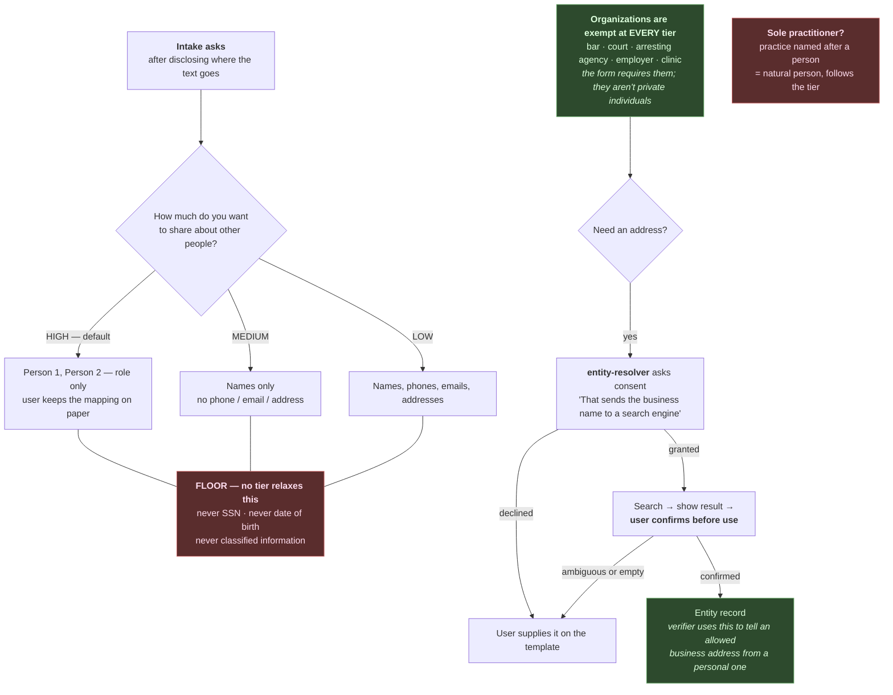
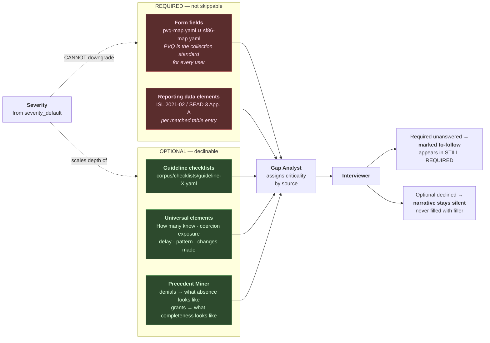
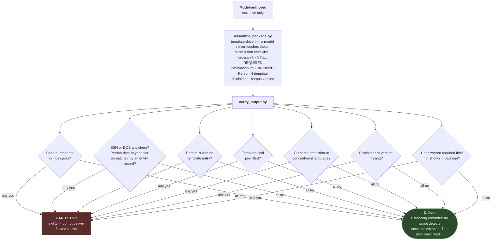
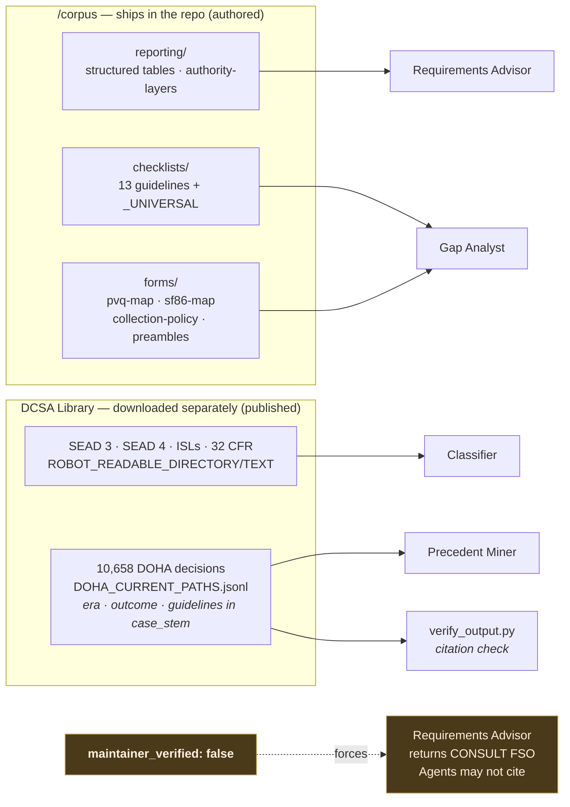
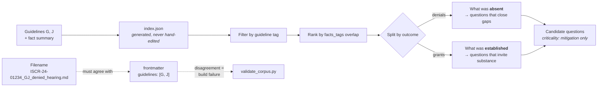

# Process Map

How a session actually runs, what grounds each decision, and where the
guarantees are enforced.

> **`agents/conductor.md` is the generative source of the flow** — it is what
> the agents actually execute. This file renders and explains it. If the two
> disagree, conductor.md wins and this file is wrong;
> `tests/run_tests.py` includes a drift check that fails when the stage
> orders diverge.

---

## 1. Session flow

```mermaid
flowchart TD
    START(["User runs the tool"]) --> LOC

    LOC["<b>0 · Locate reference material</b><br/>corpus/ ships in the repo<br/><b>DCSA Library is a separate download</b><br/><i>says what's found and what it costs<br/>· NEVER fetches · missing = instructions only</i>"]
    CAN["<b>0b · Capability canary</b><br/>model answers a known scenario,<br/>then checks itself<br/><i>fail = warn the user, don't halt</i>"]
    LOC --> CAN --> INTAKE

    INTAKE["<b>1 · Intake</b><br/>You are John Doe · deployment mode disclosed<br/><b>privacy tier chosen</b> — high / medium / low<br/>checkpoint file disclosed · no classified information"]
    CTX["<b>Context</b><br/>Applicant or holder? Industry or federal?<br/>Baseline or TS/Q? National security, public trust, low risk?"]
    NARR["<b>Open narrative</b><br/>'Tell me, in your own words,<br/>what you feel you have to report'<br/><i>stamped with a hash — never edited after</i>"]
    INTAKE --> CTX --> NARR --> REQ

    REQ["<b>① Requirements Advisor — WHAT MUST BE REPORTED</b><br/>matched on <i>event type</i>, needs no guideline tags<br/>Returns YES or CONSULT SECURITY OFFICE — never 'no'"]
    LAY{"Population?"}
    REQ --> LAY
    LAY -->|"cleared industry"| L1["<b>SEAD 3 + ISL 2021-02</b><br/>channel: FSO → DISS · DCSA CISA"]
    LAY -->|"federal civilian<br/>or military"| L2["<b>SEAD 3 only</b><br/>+ their agency's own implementation<br/>channel: servicing security office<br/><i>never DISS — they can't access it</i>"]
    L1 --> RDEC
    L2 --> RDEC
    RDEC{"Reportable?"}
    RDEC -->|yes| WARN
    RDEC -->|unclear| FSO

    WARN["<b>⚠ IMMEDIATE SPOKEN WARNING</b><br/>'The clock started at the event, not here.<br/>If you can't finish today, call your security office today.'<br/>No stub document — the session continues"]
    FSO["'Raise this with your security office'<br/>with the ambiguity explained<br/><i>verified table threshold may be quoted,<br/>never as advice not to report</i>"]

    FLOOR["<b>The floor is not the ceiling</b><br/>'That's what policy requires. If there's anything else<br/>you feel you should disclose, you should —<br/>volunteering it counts in your favor.'<br/><i>voluntary matters are treated identically</i>"]
    WARN --> FLOOR
    FSO --> FLOOR
    FLOOR --> APPQ
    APPQ{"Still an applicant?"}
    APPQ -->|no| CLASS
    APPQ -->|yes| APP
    APP["<b>Additionally for applicants</b><br/>which PVQ / SF-86 items now need an affirmative answer<br/><i>an in-process applicant IS a covered individual —<br/>reportability was determined above, never skipped</i>"]
    APP --> CLASS

    CLASS["<b>② Classifier — WHAT IT'S GRADED AGAINST</b><br/>SEAD 4 guidelines A–M<br/><i>what adjudicators will look at, never a verdict</i>"]
    EDEC{"Concealment indicator,<br/>or merely late?"}
    EATT["<b>Concealment</b> — auto-attach Guideline E<br/>and explain why to the user"]
    EDEL["<b>Late only</b> — no E<br/>delay explanation becomes REQUIRED<br/><i>a self-corrector is not a concealer</i>"]
    CLASS --> EDEC
    EDEC -->|"false statement made"| EATT --> PACE
    EDEC -->|"no false statement"| EDEL --> PACE

    PACE["<b>Pace choice</b><br/>essentials only · or thorough<br/><i>switchable any time — required fields never skipped</i>"]
    PACE --> SRC
    SRC["<b>Question sourcing</b><br/>see diagram 3"]
    SRC --> LOOP

    LOOP["<b>Gap → Interview loop</b><br/>progress shown each round: 'Matter 2 of 3 — 6 required left'<br/>Gap Analyst finds what's missing · Interviewer asks<br/><i>doesn't know the court? → court_lookup nudge,<br/>user confirms, THEIR answer is recorded</i>"]
    LDEC{"Required fields answered<br/>or marked to-follow?"}
    LOOP --> LDEC
    LDEC -->|no| LOOP
    LDEC -->|yes| THREAD

    THREAD["<b>Thread Detector</b><br/>Did that answer open a NEW reportable matter?<br/><i>follows what was said — never fishes</i>"]
    TDEC{"New thread?"}
    THREAD --> TDEC
    TDEC -->|"yes — user consents"| REQ
    TDEC -->|"yes — user declines"| NOTE["Recorded · told it's still reportable<br/>· never raised again"]
    TDEC -->|"none, or depth 5"| CONS
    NOTE --> CONS

    CONS["<b>Consistency Checker</b><br/>Contradictory dates · impossible sequences<br/>conflicts with the filed form<br/><i>surfaces to the user, never resolves</i>"]
    DOCS["<b>Documents Advisor</b><br/>THREE records, with timing:<br/>court disposition · arrest report · driver record<br/><i>the driver record recovers forgotten dates fastest</i>"]
    WRITE["<b>Narrative Writer</b><br/>First person · active voice · the user's own register<br/>numbered placeholders — never names"]
    CAND["<b>Candor Reviewer</b><br/>Compare draft against raw intake<br/>Catch dropped facts, softened quantities,<br/>and paraphrased outcome/concealment language"]
    CONS --> DOCS --> WRITE --> CAND --> GATE

    GATE["<b>Deterministic gates</b><br/>see diagram 4"]
    GATE --> HANDOFF

    HANDOFF(["<b>Handoff</b><br/>Replace John Doe with your legal name<br/>Complete the Person N template<br/><b>Run the verifier yourself and match the SHA-256</b><br/>Verify every fact — you sign it"])

    TRIAGE["<b>Triage</b><br/>standing rules on every message<br/><b>+ mandatory checkpoints, logged to the state file</b><br/>after narrative · each gap round · before any thread<br/>expansion · before assembly<br/><i>warns, recommends, never halts</i>"]
    TRIAGE -.->|monitors| NARR
    TRIAGE -.->|monitors| LOOP
    TRIAGE -.->|monitors| THREAD
    TRIAGE -.->|monitors| GATE

    classDef warn fill:#5a2d2d,stroke:#c66,color:#fde
    classDef gate fill:#2d3a5a,stroke:#68c,color:#def
    classDef monitor fill:#4a3a1a,stroke:#ca6,color:#fed
    classDef step fill:#2d4a2d,stroke:#6a6,color:#dfd
    class WARN warn
    class GATE,CAND,CAN gate
    class TRIAGE monitor
    class REQ,CLASS,PACE step
    class FLOOR step
    class L2 warn
    class THREAD monitor
    class EDEL step
    class LOC gate
```

**The session is a loop, not a line.** A matter rarely arrives alone: an OWI
mentions court-ordered therapy, the therapy mentions an assault, the assault
mentions cocaine. Each is separately reportable, and each surfaced only
because the one before it was explored. So an accepted thread re-enters at ①
as a new matter with its own reportability determination, timeliness warning,
classification, and required fields.

Two limits keep that from becoming an interrogation. The detector **follows
only what the user actually said** — "you mentioned therapy" is a thread,
"any other crimes?" is fishing — and **every expansion is consented to** before
the scope widens. A declined thread is recorded, honestly flagged as still
reportable, and never raised again.

**Order matters.** SEAD 3 creates the obligation; SEAD 4 is the lens applied
to what gets disclosed. Reportability is settled before anything is
classified, and never depends on the classification — the tables key on event
type, not adjudicative category. A guideline the classifier can't map
confidently does not make a matter unreportable.

**Two layers of authority, and they are not the same document.** SEAD 3 is
the Security Executive Agent's directive and binds **every** covered
individual — contractor, federal civilian, military. ISL 2021-02 is DCSA's
implementation of it for NISP contractors only, layered on top. A federal
employee is not exempt from reporting analysis; they are exempt from DCSA's
version of it. "Not industry" must never become "no obligation."

Channels follow the same split. FSO → DISS and the DCSA CI Special Agent are
the industry mechanism; a federal employee reports through their servicing
security office. Naming a system the user cannot access reads as
authoritative and sends them nowhere useful.

**Applicants are covered individuals too.** "Covered individual" includes a
person *in process for* eligibility, so an applicant with a new reportable
matter has a SEAD 3 obligation while their case is in flight — they get the
full reportability pass, with the channel adjusted (sponsoring FSO for
industry, hiring agency security office for federal; unverified entries
degrade to "confirm with the office sponsoring your case"). Their extra step
is the form-question mapping: which of the form's own questions now require
an affirmative answer.

---

## 2. Privacy tiers

Upgrading tier mid-session is free and redacts retroactively. Downgrading
takes one confirmation, because it means re-entering what the user chose to
withhold — and the tool never suggests a downgrade to speed up the interview.
Interview fatigue is not consent.

---

## 3. Where questions come from, and which are optional

A minor-in-possession is low severity and still needs the court, the date, the
disposition, the fine amount, and whether it was paid in full. **Severity buys
brevity on context, never on the form.**

Sensitivity is a separate axis: Section 19's counseling questions are both
sensitive *and* required. Sensitivity governs how gently it's asked;
criticality governs what happens if it's absent.

---

## 4. Trust gates

Because the tool is model-agnostic, no platform enforces that an agent only
read `/corpus`. Prompt restrictions are requests. **The scripts are the
control.**

---

## 5. What grounds each agent

Every citation resolves to a file. Nothing is recalled from model memory.

**Everything ships unverified.** Until a human checks a corpus file against
its official source, agents treat it as uncitable and reportability degrades
to "ask your FSO." The scaffold is honest about being a scaffold.

---

## 6. Case retrieval

Precedent never creates a **required** element — only the form and the
reporting tables do that. And no rate, tendency, or likelihood ever reaches
the user: the corpus is contested SOR cases, a selection-biased sample that
says nothing about how ordinary reports resolve.
